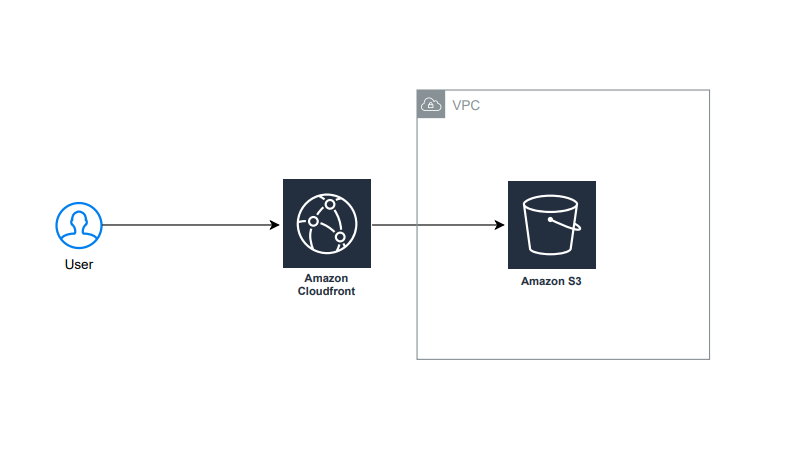

# Secure Static Website Hosting on AWS

## Overview
This project demonstrates a secure, cloud-native approach to hosting a static website on AWS using S3 and CloudFront.

## Architecture
- Amazon S3 (private bucket)
- Amazon CloudFront (CDN)
- Origin Access Control (OAC)
- AWS Certificate Manager (ACM)
- 

## Security Considerations
- S3 bucket is not publicly accessible
- CloudFront is the only allowed origin
- HTTPS enforced end-to-end
- IAM permissions follow least privilege

## Infrastructure as Code
All infrastructure is provisioned using Terraform.

## Cost Awareness
- Uses AWS free tier where possible
- CDN minimizes origin requests

## Deployment
Instructions will be added as the project evolves.

